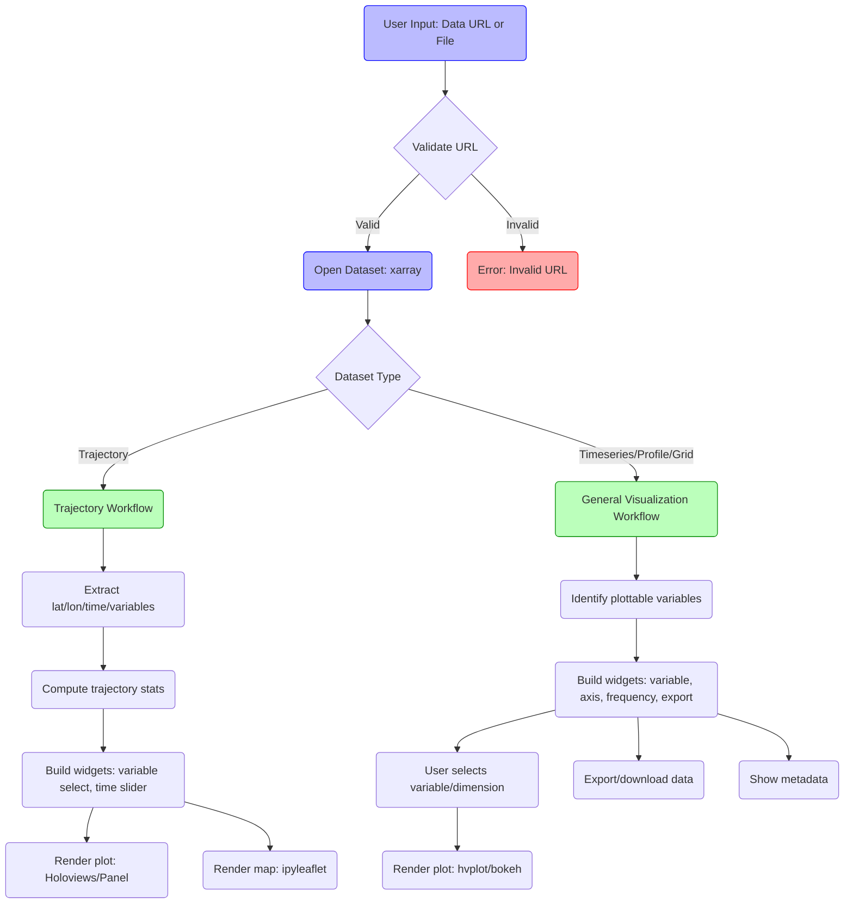

# Metviz Data Model and Workflow Documentation

## 1. Core Data Model Classes

- **ModelURL (metviz/TSP/utility.py)**
  - A Pydantic model for validating URLs (especially for data sources).
  - Ensures URLs are valid HTTP/OPeNDAP endpoints before ingestion.

- **xarray.Dataset**
  - The primary in-memory data structure for all ingested data.
  - Used for both trajectory and general (grid/timeseries/profile) datasets.
  - Data variables are filtered for plotting using rules (numeric, non-coordinate, not QC/flag).

---

## 2. Data Ingestion and Validation Logic

- **URL Validation**
  - `validate_url(url)`: Uses `ModelURL` to check if the URL is a valid HTTP/OPeNDAP endpoint.
  - `validate_opendap(url)`: Tries to open the dataset with xarray to ensure it is accessible and valid.

- **Dataset Loading**
  - For trajectory: `_open_dataset(url)` in `trj/main.py` loads the dataset and raises clear errors if it fails.
  - For general workflow: `load_data(url)` (not shown in full, but referenced in TSP/main.py) loads and decodes datasets, returning the dataset and metadata.

---

## 3. Visualization Workflow and Widget Logic

- **Variable Selection**
  - Uses helpers like `get_plottable_vars(ds)` and `is_plottable(name, var)` to filter variables suitable for plotting.
  - Excludes coordinate-like, QC, and non-numeric variables.

- **Axis Selection**
  - `get_axis_candidates(ds, var_name)`: Determines which variables or coordinates can be used as axes for plotting.

- **Widgets**
  - Built using Panel (`pn.widgets`): variable selectors, axis selectors, frequency selectors, export buttons, metadata display, etc.
  - For trajectory: widgets for variable, time slider, and map location.
  - For general: widgets for variable, axis, frequency, export, and metadata.

- **Plotting**
  - Uses Holoviews, hvplot, and Bokeh for rendering.
  - Handles special cases for timeseries, profiles, and grid data (e.g., quadmesh for 2D, line for 1D).
  - Trajectory workflow also renders a map using ipyleaflet.

- **Export and Metadata**
  - Download/export widgets allow users to export selected data.
  - Metadata widgets display dataset attributes and variable metadata.

---

## 4. Data Requirements for Ingestion and Visualization

- **Input Data**
  - Must be accessible via a valid HTTP/OPeNDAP URL.
  - Must be in a format readable by xarray (NetCDF, Zarr, etc.).
  - Should contain numeric variables with at least one dimension for plotting.
  - For trajectory visualization: must have latitude, longitude, and time variables.

- **Metadata**
  - Variables should have `long_name` and `units` attributes for labeling.
  - Dataset-level attributes are used for metadata display and workflow branching (e.g., `featureType`).

- **Quality Control**
  - QC/flag variables are excluded from visualization by default.

---

## 5. Workflow Diagram

Below is a high-level workflow diagram for data ingestion and visualization in Metviz:

This document provides a comprehensive overview of the data model, ingestion, and visualization workflow for the Metviz application. For further details, refer to the codebase or request a specific class diagram or schema.