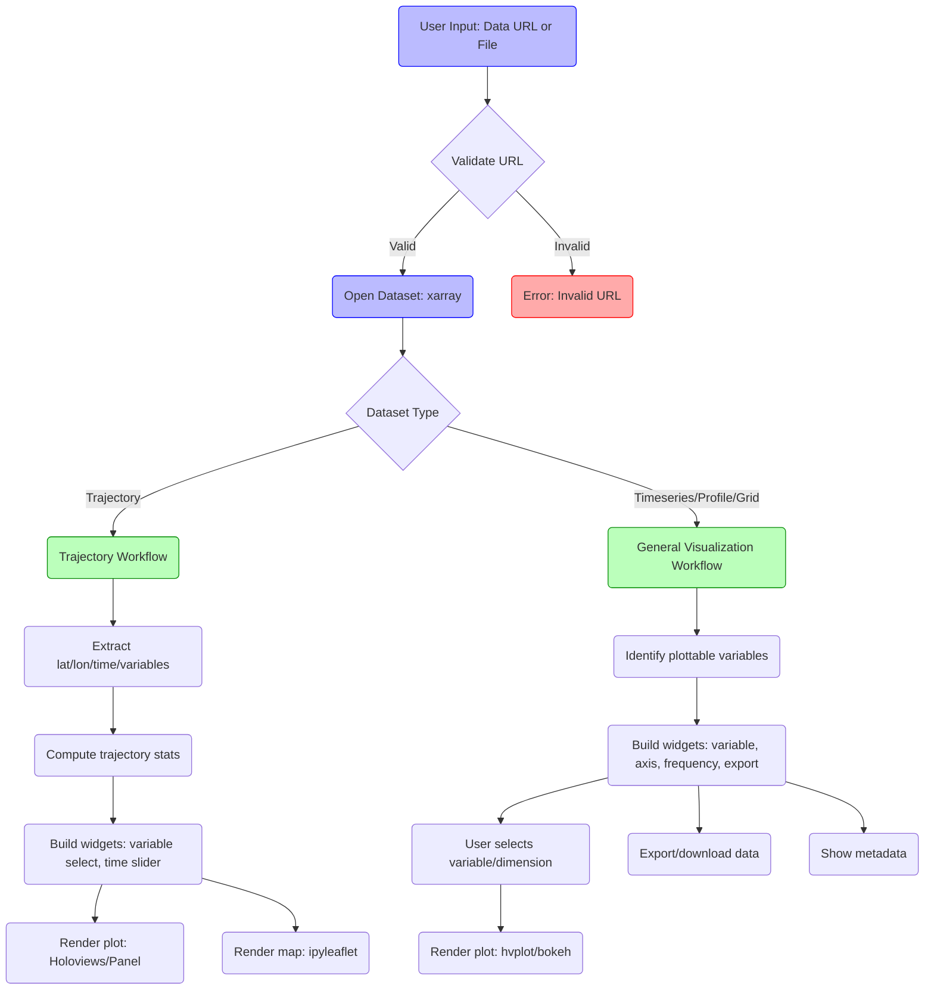

# Metviz Data Ingestion & Visualization Workflow Diagram

```mermaid
flowchart TD
    A(User Input: Data URL or File) --> B{Validate URL}
    B -- Valid --> C(Open Dataset: xarray)
    B -- Invalid --> Z(Error: Invalid URL)
    C --> D{Dataset Type}
    D -- Trajectory --> E(Trajectory Workflow)
    D -- Timeseries/Profile/Grid --> F(General Visualization Workflow)
    E --> E1(Extract lat/lon/time/variables)
    E1 --> E2(Compute trajectory stats)
    E2 --> E3(Build widgets: variable select, time slider)
    E3 --> E4(Render plot: Holoviews/Panel)
    E3 --> E5(Render map: ipyleaflet)
    F --> F1(Identify plottable variables)
    F1 --> F2(Build widgets: variable, axis, frequency, export)
    F2 --> F3(User selects variable/dimension)
    F3 --> F4(Render plot: hvplot/bokeh)
    F2 --> F5(Export/download data)
    F2 --> F6(Show metadata)
    style Z fill:#faa,stroke:#f00
    style A fill:#bbf,stroke:#00f
    style C fill:#bbf,stroke:#00f
    style E fill:#bfb,stroke:#080
    style F fill:#bfb,stroke:#080
```

